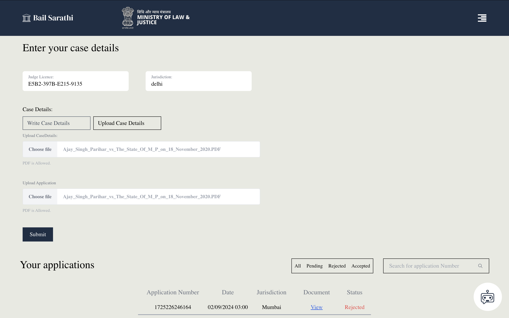
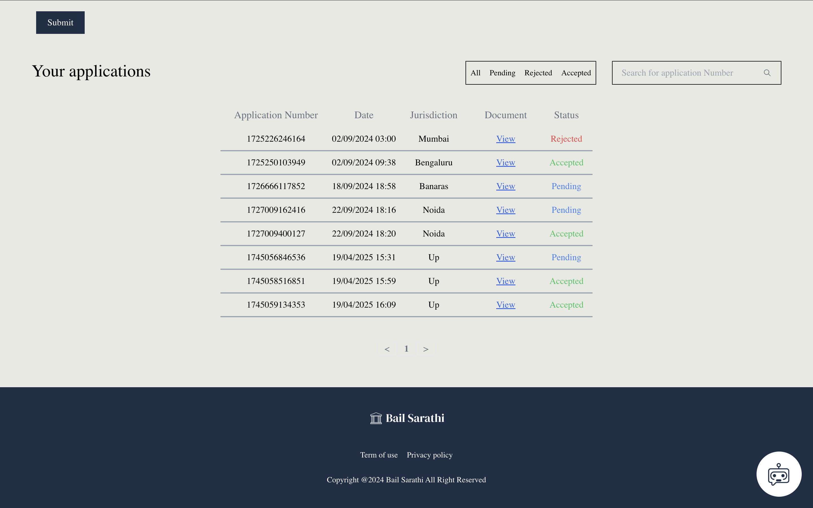
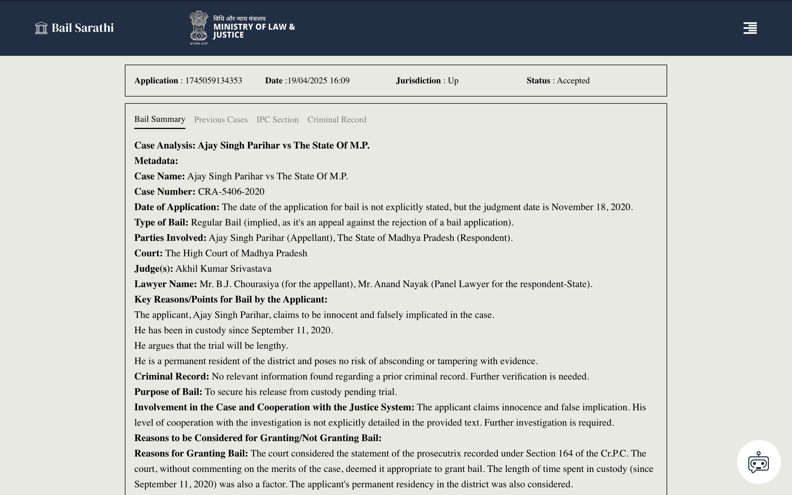
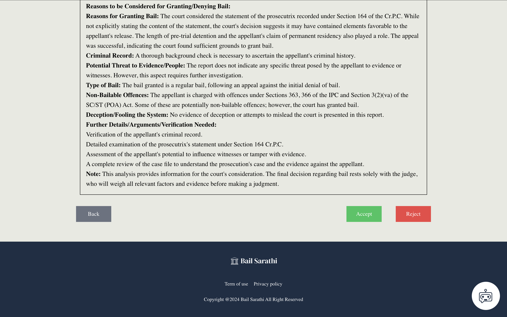

# Bail Sarathi - Legal Assistance Platform for Bail Matters

Bail Sarathi is a full-stack web application designed to streamline the bail application process, connecting users (lawyers, judges) and leveraging AI to provide insights and summaries related to bail cases.

## Table of Contents

- [Overview](#overview)
- [Key Features](#key-features)
- [Tech Stack](#tech-stack)
  - [Frontend](#frontend)
  - [Backend](#backend)
  - [Database](#database)
  - [AI/ML](#aiml)
  - [Deployment/Storage](#deploymentstorage)
- [Project Structure](#project-structure)
- [Setup and Installation](#setup-and-installation)
  - [Prerequisites](#prerequisites)
  - [Environment Variables](#environment-variables)
  - [Backend Setup](#backend-setup)
  - [Frontend Setup](#frontend-setup)
- [Running the Application](#running-the-application)
- [API Endpoints](#api-endpoints)
- [Screenshots](#screenshots)
- [License](#license)

## Overview

The platform aims to assist legal professionals (lawyers and judges) by:

-   Allowing lawyers to submit bail applications electronically, including relevant case documents.
-   Utilizing AI models (powered by Google Gemini) to:
    -   Summarize bail applications.
    -   Extract relevant IPC sections.
    -   Identify potential criminal history keywords.
    -   Find similar previous cases from a vector database.
-   Providing a dashboard for judges to review submitted applications, view AI summaries, and update application statuses (Accept/Reject).
-   Notifying lawyers via email when the status of their application changes.
-   Implementing a chatbot for user assistance regarding bail procedures and platform features.
-   Ensuring secure authentication and route protection.

## Key Features

-   **User Authentication:** Secure login for lawyers and judges.
-   **Role-Based Access Control:** Different dashboards and functionalities for lawyers and judges.
-   **Bail Application Submission:** Lawyers can upload PDF documents for case details and the main application.
-   **AI-Powered Analysis:**
    -   Bail Application Summarization
    -   Relevant IPC Section Identification
    -   Criminal History Keyword Extraction
    -   Similar Previous Case Retrieval (using vector embeddings)
-   **Judge Dashboard:** View pending/reviewed applications, filter by status, search by application number, view AI summaries, Accept/Reject applications.
-   **Lawyer Dashboard:** View submitted applications and their current status.
-   **Email Notifications:** Automated status updates sent to lawyers.
-   **Chatbot:** Integrated AI chatbot for user queries.
-   **Document Storage:** Securely stores uploaded application documents (using Appwrite).
-   **Persistent Login:** User sessions are maintained across page reloads.

## Tech Stack

### Frontend

-   **Framework:** React.js
-   **State Management:** Redux Toolkit
-   **Routing:** React Router DOM
-   **Styling:** Tailwind CSS
-   **API Calls:** Axios (via `apiConnector` utility)
-   **UI Components:** Custom components, `react-hot-toast`, `react-paginate`, `react-markdown`
-   **Icons:** `react-icons`

### Backend

-   **Framework:** Flask (Python)
-   **Database ORM/Driver:** PyMongo
-   **CORS Handling:** `flask-cors`
-   **Authentication:** JWT (implied, based on token usage)
-   **Email:** `flask-mail`
-   **File Handling:** Werkzeug, PyPDF2

### Database

-   **Primary Database:** MongoDB

### AI/ML

-   **Language Models:** Google Gemini (via `google-generativeai` SDK)
-   **Vector Embeddings/Search:** Langchain, ChromaDB 

### Deployment/Storage

-   **Document Storage:** Appwrite Cloud Storage

## Project Structure

```
bail-sarathi/
├── client/             # React Frontend
│   ├── public/
│   └── src/
│       ├── assets/
│       ├── components/   # Reusable UI components (Navbar, Footer, Modals, etc.)
│       ├── hooks/        # Custom hooks (if any)
│       ├── pages/        # Page-level components (Login, AdminDashboard, BailApply, etc.)
│       ├── reducer/      # Redux root reducer
│       ├── services/     # API endpoint definitions, connectors, operations
│       ├── slices/       # Redux Toolkit slices (auth, user, summary, etc.)
│       ├── App.css
│       ├── App.js        # Main application component with routing
│       ├── index.css
│       └── index.js      # Application entry point
├── server/             # Flask Backend
│   ├── config/         # Configuration files (database, AI keys)
│   ├── controllers/    # Route handlers (auth, bailout)
│   ├── mails/          # Email templates
│   ├── models/         # Data models (Python classes for DB interaction)
│   ├── scripts/        # Python scripts for AI analysis (summarization, IPC, etc.)
│   │   └── chatbot/      # Chatbot specific logic and knowledge base
│   │   └── Bail_Saarathi/ # AI/Vector DB related files
│   ├── temp_uploads/     # Temporary storage for uploads
│   ├── .env            # Environment variables (MUST be created)
│   └── main.py         # Flask application entry point
├── .gitignore
└── README.md           # This file
```

## Setup and Installation

### Prerequisites

-   Node.js and npm (or yarn) for the frontend.
-   Python 3.x and pip for the backend.
-   MongoDB instance (local or cloud-based like MongoDB Atlas).
-   Appwrite Cloud project for document storage.
-   Google AI API Key (for Gemini models).
-   An email service provider account (e.g., Gmail with App Password, SendGrid) for sending status updates.

### Environment Variables

Create a `.env` file in the `server/` directory with the following variables:

```dotenv
# MongoDB
MONGODB_URL=your_mongodb_connection_string

# Google AI
GOOGLE_API_KEY=your_google_gemini_api_key

# Appwrite
APPWRITE_ENDPOINT=https://cloud.appwrite.io/v1 # Or your self-hosted endpoint
APPWRITE_PROJECT_ID=your_appwrite_project_id
APPWRITE_API_KEY=your_appwrite_server_api_key
APPWRITE_BUCKET_ID=your_appwrite_storage_bucket_id # Bucket for application PDFs

# Email (Example using Gmail - Use App Password if 2FA enabled)
MAIL_HOST=smtp.gmail.com
MAIL_PORT=587
MAIL_USER=your_email@gmail.com
MAIL_PASS=your_gmail_app_password_or_regular_password

# JWT Secret (Add if implementing JWT for auth)
# JWT_SECRET=your_strong_jwt_secret_key
```

**Note:** Ensure your MongoDB database name is correctly referenced (currently seems to be `"test"` in `server/models/model.py` and `server/controllers/bailout.py`).

### Backend Setup

1.  Navigate to the `server` directory:
    ```bash
    cd server
    ```
2.  Create a virtual environment (recommended):
    ```bash
    python -m venv venv
    source venv/bin/activate  # On Windows use `venv\Scripts\activate`
    ```
3.  Install dependencies:
    ```bash
    pip install -r requirements.txt # Make sure you have a requirements.txt!
    ```
    *(If `requirements.txt` doesn't exist, you'll need to install Flask, PyMongo, Flask-CORS, Flask-Mail, google-generativeai, python-dotenv, PyPDF2, langchain, possibly others based on `scripts` imports)*

### Frontend Setup

1.  Navigate to the `client` directory:
    ```bash
    cd ../client # Or from the root: cd client
    ```
2.  Install dependencies:
    ```bash
    npm install
    # or
    yarn install
    ```

## Running the Application

1.  **Start the Backend Server:**
    -   Make sure you are in the `server` directory with the virtual environment activated.
    -   Run the Flask app:
        ```bash
        flask run --port 5001
        # or directly
        python main.py
        ```
    -   The backend should be running on `http://localhost:5001`.

2.  **Start the Frontend Development Server:**
    -   Make sure you are in the `client` directory.
    -   Run the React app:
        ```bash
        npm start
        # or
        yarn start
        ```
    -   The frontend should open automatically in your browser at `http://localhost:3000`.

## API Endpoints


-   **Auth:**
    -   `POST /api/login`: User login.
    -   `POST /api/signup`: User registration.
-   **Bailout:**
    -   `POST /api/create-application`: Submit a new bail application (Lawyer).
    -   `POST /api/get-lawyer-bails`: Fetch applications submitted by a lawyer.
    -   `POST /api/get-judge-bails`: Fetch applications assigned to a judge.
    -   `POST /api/change-status`: Update the status of an application (Judge).
    -   `POST /api/bail-summary`: Fetch details for a specific application.
-   **Chatbot:**
    -   `POST /api/test-chatbot`: Interact with the AI chatbot.

## Screenshots

-   Login Page: 

-   Apply Bail Form

-   Judge Dashboard:

-   Bail Summary View: 




## License

This project is licensed under the GNU General Public License v2.0 - see the LICENSE.md file for details (if applicable).
